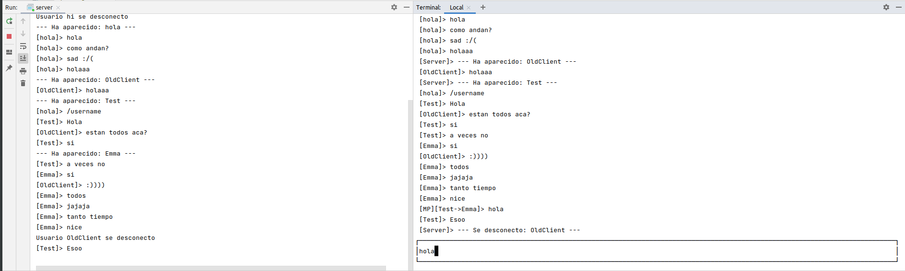

# Chat por consola nativo

Una app de chat en consola con ncurses

Comandos:
* "/msg username message": Mandar un mensaje privado a un usuario
* "/nickname": Cambiar tu nombre de usuario
* "/join room": Unirse a una sala de chat, si no existe es creada
* "/exit": Salir

Los mensajes tienen un tamaño maximo de <2KB.

## Cliente

La idea del cliente fue utilizar 3 hilos:
* uno encargado de enviar mensajes (sender),
* otro de recivirlos (reciever) y, por ultimo,
* la interfaz de usuario (UI) que es la ocupada de comunicarse con el usuario.

Para cominarse entre si, se propusieron dos queues:
* una para los mensajes a enviar y, otra que,
* representa el historial de mensajes local.
Para que los 3 hilos no compitan, ni se generen deadlock, se implementaron los locks necesario para cada estructura.
Para la UI se utilizo ncurses para una intrefaz mas limpia y facil de utilizar.

## Server

En la implementacion del server, se hizo uso de 2 hilos:
* uno para esperar conexiones de nuevos clientes y
* otro que se encarga de recibir y enviar mensajes.

La informacion del usuario almacenada en el servidor es:
* su socket,
* su estado (vivo o muerto),
* su nombre de usuario y,
* el canal actual del mismo.

Al recibir un mensaje, este lo reenvia a todos los usuarios, inclusive al remitente (para mantener un historial local). De esta forma, el servidor no mantiene ningun estado ni historial de los mensajes enviados, solo sirve de nexo entre clientes.
